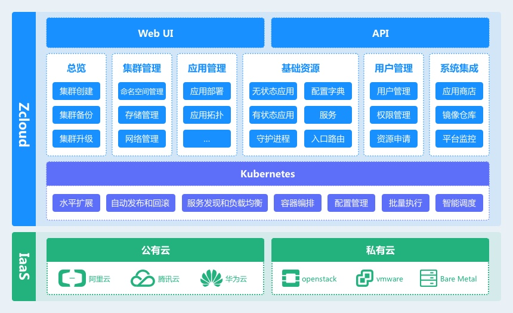

# 1      文档介绍

## 1.1         文档的目的

此文档是提供用于软件开发部门和产品设计部门、产品测试部门之间就此产品的需求分析、产品开发、产品设计、测试方案交流的基础；

## 1.2         参考文档

| **序号** | **文档名称** | **作者** | **来源**                                                     |
| -------- | ------------ | -------- | ------------------------------------------------------------ |
| 1        | 产品原型     | 王少帅   | https://lanhuapp.com/web/#/item/project/product?pid=ae53d49b-3634-4b45-86c5-602306d459b9&docId=39f5c399-104a-4781-983a-0f34a7e0d50f&docType=axure&pageId=6190da3959c241c5ba311eea7a3bd897&image_id=39f5c399-104a-4781-983a-0f34a7e0d50f |
| 2        | 产品设计     | 关倩     | https://lanhuapp.com/web/#/item/project/board?pid=ae53d49b-3634-4b45-86c5-602306d459b9&docId=39f5c399-104a-4781-983a-0f34a7e0d50f&docType=axure&pageId=6190da3959c241c5ba311eea7a3bd897&image_id=39f5c399-104a-4781-983a-0f34a7e0d50f |

 

 

## 1.3         产品命名规范

| **产品名称Zcloud** |          |      |
| ------------------ | -------- | ---- |
| 中文名称           | 英文名称 | 备注 |
|                    |          |      |
|                    |          |      |

 

# 2      产品介绍

## 2.1         产品概要说明

Zcloud是基于容器技术的企业级云平台解决方案。结合Kubernetes对企业的物理机、虚机等资源进行统一管理。对企业的应用做统一调度。保证企业的IT系统或门户网站实现高可用、可扩展、易于发布等特性。

结构图如下：

* 全局：列出平台所有纳管的集群，并可删除、创建、编辑集群，展示平台的全局配置。
* 集群管理：对集群的资源使用情况，集群命名空间、节点、存储、网络资源管理。
* 容器管理：对集群的容器运行时进行监控与保活，对于各容器使用的镜像进行管理。
* 应用商店：对平台支持的应用模版进行说明展示。
* 应用管理：以命名空间为维度进行资源监控展示，对已安装的应用进行管理，并进行应用相关资源的拓扑展示。
* 基础资源：对k8s的原生资源进行管理。
* 资源申请：普通用户进行资源配额的申请，管理员进行资源申请的审批
* 镜像仓库：跳转到镜像仓库页面
* 监控中心：跳转到监控中心页面

 

## 2.2         产品用户定位

此产品面向的主要是两类人员。一类是面向系统的运维人员，另一类是面向开发人员。因产品所包含的知识面非常广，同时也很专业，所以产品设计和实现时尽量给予简单的界面和完备的帮助，并对重要功能的业务权限要集中、重点控制。

 

## 2.3         产品中的平台

| **平台名称** | **职责描述**                                                 | **使用的功能**                   | **权限等级** |
| ------------ | ------------------------------------------------------------ | -------------------------------- | ------------ |
| 系统管理员   | 对权限进行划分，管理后台用户，对用户进行资源分配，维护基础资源可用。 | 全部                             | 1            |
| 普通用户     | 对权限内的资源有使用权。可维护自行创建的服务等。             | 只能使用指定namespaces下的资源。 | 1            |

 

# 3      产品平台通用功能

## 3.1删除

Zcloud所有资源全部是异步删除，用户列表无状态（用户被删除，下面的资源不删除）。

除了特例外，需要增加状态的资源有：namespaces、node、存储、app资源、k8s资源、资源申请。资源表格增加删除时间列。

以上资源，除了删除中的状态，其他状态都可以删除。

删除中的状态，只能等待资源删除成功或删除失败。

删除成功的资源，在系统内要清理干净。

对于删除失败的资源，可以再次删除。删除失败当前页面资源下方使用红色小子提示，同时写入Zcloud平台事件。

## 3.2 负载联动

外部负载需求

K8s包含三种类型的服务：ClusterIP、[NodePort](https://v1-16.docs.kubernetes.io/zh/docs/concepts/services-networking/service/#nodeport)、[LoadBalancer](https://v1-16.docs.kubernetes.io/zh/docs/concepts/services-networking/service/#loadbalancer)。

Ø **ClusterIP**：通过集群的内部 IP 暴露服务，服务只能够在集群内部可以访问。

Ø [**NodePort**](https://v1-16.docs.kubernetes.io/zh/docs/concepts/services-networking/service/#nodeport)**：**通过每个 Node 上的 IP 和静态端口暴露服务。NodePort 服务会NAT到 ClusterIP 服务。

Ø [**LoadBalancer**](https://v1-16.docs.kubernetes.io/zh/docs/concepts/services-networking/service/#loadbalancer)**：**负载局衡器，可以向外部暴露服务。外部的负载均衡器可以路由到 NodePort 服务和 ClusterIP 服务。

以下需求全部是针对[LoadBalancer](https://v1-16.docs.kubernetes.io/zh/docs/concepts/services-networking/service/#loadbalancer)类型的服务提出。

### 3.2.1、新增

#### 3.2.1.1、SLB硬件设备新增

在Zcloud启动时指定SLB硬件设备与连接信息。

#### 3.2.1.2、[LoadBalancer](https://v1-16.docs.kubernetes.io/zh/docs/concepts/services-networking/service/#loadbalancer)服务新增

[LoadBalancer](https://v1-16.docs.kubernetes.io/zh/docs/concepts/services-networking/service/#loadbalancer)类型的服务被创建时，此事件应及时被监听处理。通过服务的配置信息（VIP，PORT，Endpoint，PATH等），由K8s内部插件主动向外部调用API，创建负载策略。每个VIP支持绑定多个不同端口的服务。

### 3.2.2、删除

当[LoadBalancer](https://v1-16.docs.kubernetes.io/zh/docs/concepts/services-networking/service/#loadbalancer)类型的服务被删除时，此事件应及时被监听处理。与此服务相关的所有负载策略一并清除。

### 3.2.3、修改

当[LoadBalancer](https://v1-16.docs.kubernetes.io/zh/docs/concepts/services-networking/service/#loadbalancer)类型的服务被修改时，此事件应及时被监听处理。端口变更，实例变化。

### 3.2.4、查看

#### 3.2.4.1、SLB硬件设备

从设备按业务能获取到以下指标：

HTTP的每秒请求包数，服务的网络吞吐量，服务的总连接数，请求命中率。

#### 3.2.4.2、负载策略

按服务显示已经配置的负载策略。Vip，端口，endport，endip等等。

# 4  非功能性需求

## 4.1界面操作需求

整体风格保持一致，功能操作使用按钮，操作在同一界面上完成。

兼容800X600以及以上各分辨率。

## 4.2性能需求

同时支持50个集群的管理，单集群支持1000个节点。

## 4.3安全性需求

高级管理员与普通用户以权限划分不同的操作资源。

## 4.4版本维护与升级

### 4.4.1 版本维护

​		一年定义两个Zcloud发型大版本，大版本发版时间为3个月。同时我们最多维护两个大版本Va、Vb(最新)。低于两个版本的老用户，我们提供升级服务。不升级的用户版本我们不再做bug修复与功能更新。Va、Vb我们只做bug修复，并合并到master。每个大版本的发布必须通过集成测试。

​		每个Zcloud版本对应一个k8s版本。

### 4.4.2 版本升级要求

升级窗口时间不做强制性要求。

要保证配置数据与业务数据不丢失。

全部采用离线升级的方法。

升级必须有切实可行的回滚方案，并且是经过测试的。

升级时，如果需要业务中断，需要在30分钟内完成。

Zcloud出升级包与升级文档。不提供升级入口给用户。

​		以下两种情况需要升级k8s

​		1、在k8s新版中有满足客户需求的功能

​		2、k8s发生对Zcloud有影响的漏洞

​		3、使用的k8s是官方维护版本

k8s升级与Zcloud版本发布保持一致，除以上两种情况外，k8s不予升级。

## 4.5可靠性和健壮性

## 4.6用户文档需求

## 4.7运行环境

浏览器Firfox、chrome

 

 

 
