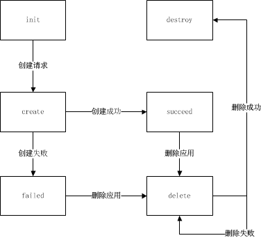

# 1      文档介绍

## 1.1         文档的目的

此文档是提供用于软件开发部门和产品设计部门、产品测试部门之间就此产品的需求分析、产品开发、产品设计、测试方案交流的基础；

## 1.2         参考文档

| **序号** | **文档名称** | **作者** | **来源**                                                     |
| -------- | ------------ | -------- | ------------------------------------------------------------ |
| 1        | 产品原型     | 王少帅   | https://lanhuapp.com/web/#/item/project/product?pid=5e0d5b50-c5e0-411a-82c7-13e7d3dd59d6&docId=99c0f495-78d3-44c2-8edc-fd54fc41ea91&docType=axure&pageId=574cfae64117412e9cde02e86880c747&image_id=99c0f495-78d3-44c2-8edc-fd54fc41ea91&parentId=6190da3959c241c5ba311eea7a3bd897 |
| 2        | 产品设计     | 关倩     | https://lanhuapp.com/web/#/item/project/board?pid=5e0d5b50-c5e0-411a-82c7-13e7d3dd59d6&docId=99c0f495-78d3-44c2-8edc-fd54fc41ea91&docType=axure&pageId=574cfae64117412e9cde02e86880c747&image_id=99c0f495-78d3-44c2-8edc-fd54fc41ea91&parentId=6190da3959c241c5ba311eea7a3bd897 |

## 1.3         产品命名规范

| **产品名称Zcloud** |          |      |
| ------------------ | -------- | ---- |
| 中文名称           | 英文名称 | 备注 |
|                    |          |      |
|                    |          |      |

# 2    开发运维功能

1、  应用商店（所有集群的命名空间看到的内容一致）

2、  应用管理

3、  基础资源

4、  资源申请

5、  登录用户下拉菜单中，不包含用户列表

6、  集群监控

# 3      产品功能结构图

* 应用商店
  
  * 本地应用模版
* 应用管理
  * 物理资源
  * 应用列表
  * 应用拓扑
* 基础资源
  
  * 无状态副本、有状态副本、守护进程、定时任务、任务、服务、服务入口、配置字典、保密字典
* 资源申请
  
  * 申请列表
* 用户管理
  
  * 用户详情、编辑、修改密码
* 系统工具
  * 镜像仓库（跳转）
  * 监控中心（跳转）
  * 日志分析（跳转）

# 4      功能需求

## 4.1         导航栏

### **4.1.1**    功能原型

*参见1.2* *参考文档*

### **4.1.2**    功能概述

对全局性的功能进行操作，包含菜单导航收缩、菜单导航、集群选择、命名空间选择、集群命令行、通知、帮助、用户功能列表。

### **4.1.3**    功能(业务)流程图

无

### **4.1.4**    功能点清单

* 导航栏
  * 导航收缩
  * 菜单导航
    * 全局、集群管理、容器管理、应用商店、应用管理、基础资源、资源申请、镜像仓库、监控中心
  * 命保空间选择
  * 集群命令行--注意权限
  * 通知
  * 帮助
  * 用户功能列表 

### **4.1.5**    功能详细描述

导航栏收缩：控制导航栏收起或展开，收起时只留图标，展示开显示图标加文字。

菜单导航：这里只包含两种逻辑，没有选择集群和已选择集群。当没有选择集群时，只显示总览与资源申请。当选择集群后，要显示所有菜单。

集群选择：下拉菜单，列出该用户权限内的所有集群，悬浮某一个集群列出该用户权限内的所有命名空间。

集群命令行：只有选择集群后，此按钮才可用。为了方便用户在任何操作页面可以随时进入集群命令行设计。

通知：zcloud产生的通知，为集群产行的告警等消息。

帮助：zcloud使用帮助手册。

用户功能：用户编辑、用户详情、修改密码、注销。

### **4.1.6**    业务数据描述

1、角色信息（角色名称、角色描述）

角色名称：20个英文字符

角色描述：50个中文字符

角色权限：复选框选择

 

2、用户信息（用户名、备注、集群权限）

​        用户名： 由字母a～z(不区分大小写)、数字0～9、点、减号或下划线组成。只能以数字或字母开头和结尾 用户名长度为4～20个字符。

​        登陆密码：6到16个字符。机器生成

## 4.5      应用商店

### **4.5.1**    功能原型

*参见原型地址*

### **4.5.2**    功能概述

​		Helm 是 Kubernetes 生态系统中的一个软件包管理工具。而Chart是helm管理应用的打包格式，一个chart对应一个或一套应用。内部是一系列的yaml描述文件，以及为yaml 服务的文件。很多的chart聚集在一起，对于用户就是一个一个的应用模版，用户可以使用这些模版快速的部署应用服务。

​		此功能涉及的资源类型：

- chart资源：chart资源提供chart的信息展示，配置展示等。在chart的详情页面可以进行app资源的创建。

​		chart资源没有父资源，也没有子资源。chart本身是独立的。

### **4.5.3**    功能点清单

- chart资源
  - 云端下载
  - 本地加载

### **4.5.4**    子功能详细描述

#### **4.5.4.1**  云端下载

​		下载chart不需要认证，且使用chart已安装的app资源不支持版本更新。直接使用helm协议进行异步下载。

​		zcloud轮询更新chart，间隔1分钟。

​		使用harbor进行chart管理，支持上传新的chart，支持上传某一个chart的新版本。harbor会重新组织索引文件。当harbor有更新时，zcloud需要在1分钟的范围内发现更新并进行下载。

​		chart页面不需要刷新，当用户再次进入页面或刷新时，才能看到新的chart。

​		下载，对比，完成需要有日志，供测试使用。

​		chart更新完成后，可立刻使用进行app资源的安装，无需更新zcloud版本。

#### **4.5.4.2**  本地加载

​		已下载的chart资源保存在本地，Zcloud启动时，是把chart资源加载到内存，还是每一个URL请求时实时在本地获取，开发自行定义。当访问Zcloud UI时，对chart资源列表进行展示， 展示内容：icon，chart名称，描述，详情按钮。		

### **4.5.5**    业务数据描述

此功能操作的范围：只有选择某一个集群时，应用商店才可见。

chart资源没有父资源，也没有子资源。chart本身是独立的。

## 4.6         应用管理

### **4.6.1**    功能原型

*参见原型地址*

### **4.6.2**    功能概述

查看当前命名空间的资源使用情况，对使用应用模版创建的应用进行管理，对已安装的应用做探测展示，列出所有相关联的资源。

- app资源：包含一个或多个k8s资源。需要在指定的namespaces进行创建。

此功能操作的范围：app资源的安装和卸载只能在namespaces下操作。

​		app资源的父资源是namespaces，如果删除namespaces，app资源也需要一起删除。app资源包含k8s的资源为引用关系。若app资源删除，在业务逻辑上，需要删除相关引用的k8s资源。

### **4.6.3**    功能点清单

* 物理资源
* 应用列表
  * 创建、展示、删除
* 应用拓扑

### **4.6.4**    子功能详细描述

#### **4.6.4.1**      物理资源

 此功能展示用户空间内的物理资源使用情况，包含CPU、MEM、POD数。采集频率为30秒。

CPU：计算用户空间内已使用CPU的总和，并与集群总体CPU资源做百分比。显示top5的POD，显示内容为pod名称，workload名称，CPU使用。按CPU由高到低排序。workload名称具有跳转到详情的功能。

MEM：计算用户空间内已使用MEM的总和，并与集群总体MEM资源做百分比。显示top5的POD，显示内容为pod名称，workload名称，MEM使用。按MEM由高到低排序。workload名称具有跳转到详情的功能。

POD数：显示用户空间内使用的pod资源占集群总POD资源的百分比。

#### **4.6.4.2**      应用列表

**创建**

- 当创建app资源时，需要根据app资源预设的属性进行设置后，再进行创建。
- 因我们规定，app资源的创建必须在指定的namespaces下进行，所以需要对chart进行检测，不允许chart进行namespaces的创建操作。
- 同一个chart资源，在同一个namespaces下，可以允许app资源多次创建，需要指定不同的k8s资源名称。
- 当app资源需要使用存储时，不必须开放pv与pvc的配置，让用户添加存储名称，类型，大小即可。pv与pvc在Zcloud帮助用户进行创建。
- 状态机如下图

**app资源展示**

对已创建的app资源进行展示，并且可以按来源chart进行分组，清晰的定义哪些app资源是从同一个chart进行创建的，这里不需要细化到版本，只细化到chart的名称即可。

- app资源展示的概要内容如下：icon，app资源名称，删除时间，创建时间，app资源URL；
- 可进行的操作如下：升级、降级、删除。
- 先按时间排序

​        对于app资源，需要接口返回app资源里引用的k8s资源。对于k8s资源的修改，目前不再单独做。先跳转到已有的应用管理进行修改。减少代码工作量。app资源详情页中，k8s资源只返回name，kind，link

​        对于k8s资源，目前只显示deployment、statefulset、daemonset，cronjob，job，config map，secret，svc，ingress，不显示pvc，pv，serviceaccount，clusterrole，clusterrolebingd，networkpolicy。

​		svc，ingress，与deployment等关系不做保存。

**app资源的子资源状态**

在app资源列表中，需要显示workload（deployment,statefulset,daemonset）的总数与ready数。例如一个app资源包含一个deployment，2个statefulset，那么app资源显示的子资源总数为3，当一个workload所有POD状态变成ready后，app子资源的ready数加1。

**删除**

​		支持一键删除已安装的app资源。删除app资源时，其所有引用的k8s资源全部要关联删除。如果app资源所有的namespaces被删除，那么app资源也要被删除。

​		删除时，需要定义删除时间，前端显示删除状态。

#### **4.6.4.3**      应用拓扑

### **4.6.5**    业务数据描述

## 4.7         基础资源管理

### **4.7.1**    功能原型

*参见原型地址*

### **4.7.2**    功能概述

对集群的workload进行管理，无状态副本（deployment）、有状态副本（statefulset）、守护进程集（deamonset）、定时任务（cronjob）、任务（job）、配置字典（configmap）、保密字典（secret）、服务（service）、服务入口（ingress）、UDP服务入口（udp_ingress）。

### **4.7.3**    功能点清单

* 无状态副本
  * 副本展示
  * 副本删除
  * 副本新建
  * 增加POD个数
  * 升级与回滚
* 有状态副本
  - 副本展示
  - 副本删除
  - 副本新建
  - 增加POD个数
  - 升级与回滚
* 守护进程集
  - 进程集展示
  - 进程集删除
  - 进程集新建
  - 升级与回滚
* 定时任务
  - 任务展示
  - 任务删除
  - 任务新建
  - 增加POD个数
* 任务
  - 任务展示
  - 任务删除
  - 任务新建
* 服务
  * 服务展示
  * 服务创建
  * 服务删除
* 服务入口
  - 入口展示
  - 入口创建
  - 入口删除
* UDP服务入口
  - 入口展示
  - 入口创建
  - 入口删除
* 配置字典
  * 配置展示
  * 配置创建
  * 配置删除
  * 配置修改
  * 自动加载
* 保密字典
  - 保密字典展示
  - 保密字典创建
  - 保密字典删除
  - 保密字典修改
  - 自动加载 

### **4.7.4**    子功能详细描述

所有deployment，statefulset，daemonset需要支持pod重启功能。应对有问题的POD进行初始化操作。

#### **4.7.4.1**      无状态副本

**创建**

deployment创建需要支持以下设置：

1、存储设置

2、环境变量设置

3、保密字典设置

4、配置字典设置

5、容器设置

6、负载均衡需要支持会话保持设置

**列表页**

显示deployment的概要信息，名称、子资源状态、副本数、创建时间

子资源状态定义如下：deployment readyReplicas/replicas

**详情页**

展示创建时的输入，展示子资源的POD列表。POD需要支持重启功能，也就是删除功能。同时POD中的每一个容器都可以查看日志与进入命令行。

**操作**

升级、回滚、删除。其中

* 升级（修改）

  启动命令，启动参数，镜像，环境变量，存储挂载路径，保密字典挂载路径，配置字典挂载路径

* 回滚

  回滚增加显示选择的内容，版本创建时间，原因，镜像名称1，镜像名称2。

  选择后下方显示与当前版本的yaml文件差异

* 删除

  直接删除workload资源，保留存储卷。

#### **4.7.4.2**      有状态副本

#### **4.7.4.3**      守护进程集

#### **4.7.4.4**      定时任务

#### **4.7.4.5**      任务

#### **4.7.4.6**      服务

**负载均衡**

增加会话保持设置。

#### **4.7.4.7**      服务入口

**修改**

域名和路径

#### **4.7.4.8**      UDP服务入口

**修改**

端口

**负载均衡**

增加负载均衡设置

#### **4.7.4.9**      配置字典

#### **4.7.4.10**      保密字典

#### **4.7.4.11**    HPA(自动伸缩)

支持两种指标的配置：资源、自定义

按资源自动伸缩，支持CPU与内存，指标可以是值，也可以是使用率，或者是平均值。

按自定义指标伸缩，支持用户的自定义指标，指标可以是值，或者是平均值。

### **4.7.5**    业务数据描述

## 4.8         资源申请

### **4.8.1**    功能概述

在平台中，资源申请为一种资源对像。此对像没有父资源，相关联的k8s资源为命名空间。普通用户只能通过此项功能进行资源的申请。用户申请的资源需要经过管理员审核通过后才可使用。

### **4.8.2**    功能点清单

* 资源申请查询
* 资源申请新建
* 资源申请祥情
* 资源申请删除
* 资源申请审批 

### **4.8.3**    功能详细描述

#### **4.8.3.1**      资源申请新建

**功能点描述：** 用户通过此功能，向管理员申请使用平台内的资源。

资源申请新建时，在用户添写命名空间后添加6个字符的sha256(username)值，开始的6个字符。例如web-7a49bc。中间需要添加中划线分隔。

#### **4.8.3.2**      资源申请详情

**功能点描述：** 普通用户使用该功能时，看到的是申请的所有信息详情页，包含拒绝原因等内容。

#### **4.8.3.3**      资源申请删除

**功能点描述：** 删除资源申请记录、此动作同时会清理用户已申请的命名空间。

正在审核的申请不允许删除，驳回、审核通过的记录才可以删除。删除申请记录时，会联动删除该命名空间。

### **4.8.4**    业务数据描述

## 4.9  用户管理

### **4.9.1**    功能概述

平台用户可以编辑。修改个人信息。 

### **4.9.2**    功能点清单

* 用户编辑
* 密码修改 

### **4.9.3**    功能详细描述

#### **4.9.3.1**      用户编辑

**功能点描述：** 此功能只能修改用户所以集群权限，其它属情字段待进一步总结需求后再给出。

#### **4.9.3.2**      密码修改

 **功能点描述：** 管理员使用此功能只能直接重置用户的密码，普通用户使用此功能只能做修改密码操作。

### **4.9.4**    业务数据描述

 系统管理

## 4.10 系统工具

### 4.10.1    功能概述

实现跳转功能，如果管理员没有安装，则需要咨询管理员。

### **4.10.2**    功能点清单 

#### **4.10.2.1**      镜像仓库

跳转

#### **4.10.2.2**      监控中心

跳转

#### **4.10.2.3**      日志分析

跳转

## 4.11 Zcloud事件

### 4.11.1    功能概述

记录Zcloud平台发生的事件，事件分类如下：k8s事件、Zcloud事件、资源预警。

某一类型可以选择忽略，或者恢复。UI铃铛要显示总条数，忽略的类型不计数。

### **4.11.2**    功能点清单 

1、k8s事件

2、Zcloud事件

3、资源预警

### **4.11.3**    功能详细描述

#### **4.11.3.1**      k8s事件

k8s发生应用事件，仅展示权限内的。  沿用现有的k8s事件展示，支持条件过滤。

#### 4.11.3.2    zcloud事件

删除、创建、修改失败，需要记录，在铃铛页面进行展示。

#### 4.11.3.3 预警

1、阈值设置

在开发运维平台，支持以下指标的定义与预警。

namespaces：CPU、MEM、存储

workload：存储

目前支持设置邮件告警。Zcloud提供预警查看功能。

2、通知

邮件通知与通过铃铛的页面进行展示。

### **4.11.4**    业务数据描述

 

 

 
