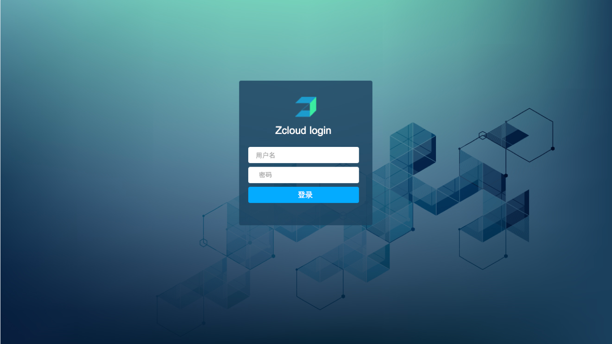
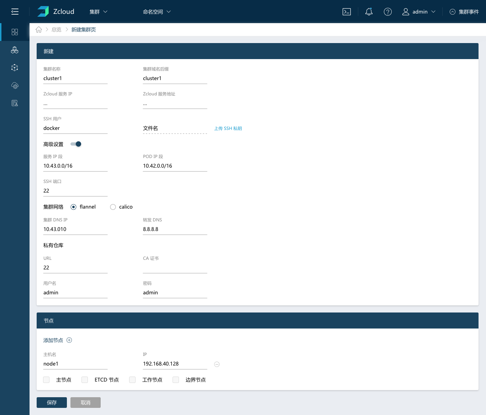
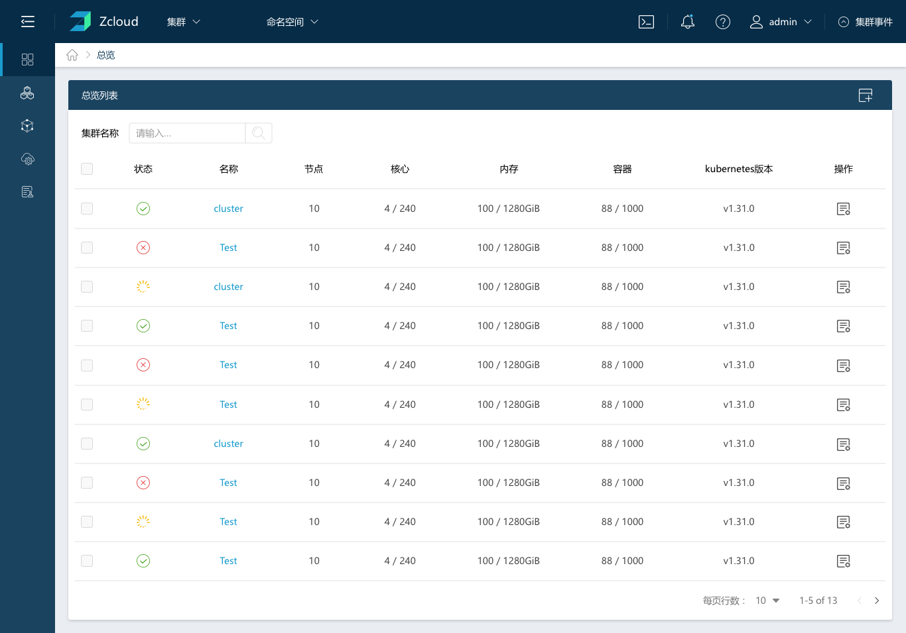

# 1 概述

什么是Zcloud？

Zcloud是一套容器管理平台，它可以帮助组织在生产环境中轻松快捷的部署和管理容器。 Zcloud可以轻松地管理各种环境的Kubernetes，满足IT需求并为DevOps团队提供支持。

Kubernetes不仅已经成为的容器编排标准，它也正在迅速成为各类云和虚拟化厂商提供的标准基础架构。Zcloud用户可以使用Zcloud UI来创建Kubernetes集群，也可以使用GKE，AKS和EKS等云Kubernetes服务。 

Zcloud支持企业使用统一认证系统中的账户进行身份验证并管理Kubernetes集群。IT管理员可以在单个页面对所有Kubernetes集群的健康状况和容量进行监控。

Zcloud为DevOps工程师提供了一个直观的用户界面来管理他们的服务容器，用户不需要深入了解Kubernetes概念就可以开始使用Zcloud。 Zcloud包含应用商店，支持一键式部署Helm模板。Zcloud通过各种云、本地生态系统产品认证，其中包括安全工具，监控系统，容器仓库以及存储和网络驱动程序。


# 1.1 架构设计


## 1.1.1 Docker

Docker是容器打包和runtime标准。开发人员从Dockerfile构建容器镜像，并从Docker镜像仓库中分发容器镜像。[Docker Hub](http://hub.docker.com/)是最受欢迎的公共镜像仓库，许多组织还设置私有Docker镜像仓库。Docker主要用于管理各个节点上的容器。

## 1.1.2 Kubernetes

Kubernetes已成为容器集群管理标准，通过YAML文件来管理配置应用程序容器和其他资源。Kubernetes执行诸如调度，扩展，服务发现，健康检查，密文管理和配置管理等功能。

一个Kubernetes集群由多个节点组成:

- **etcd database**

通常在一个节点上运行一个etcd实例服务，但生产环境上，建议通过3个或5个(奇数)以上的节点来创建ETCD 集群。

- **Master nodes**

主节点是无状态的，用于运行API Server，调度服务和控制器服务。

- **Worker nodes**

工作负载在工作节点上运行。

## 1.1.3 Zcloud

Zcloud server软件运行在独立的linux服务器上，不建议运行在kubernetes的节点上。Zcloud server本身是无状态的，可以随时重启或更新。下图说明了Zcloud的运行架构。该图描绘了管理一个kubernetes集群的Zcloud。

```
                                 +-------------------------------------------------------------+
                                 | k8s cluster deployed by zke                                 |
                                 |   +---------------------------------+      +-------------+  |
                                 |   |control plane                    |      |kubeproxy    |  |
                                 |   |                   +-----+       |      |kubelet      |  |
                                 |   |                   |etcd |       |      |             |  |
    +-------------+              |   |+------------+     +-----+       |      |node agent   |  |
    |    Zcloud   |              |   ||            |     +----------+  |      +-------------+  |
    |             |        +-----|----> api server <--+  |controller|  |                       |
    |             |        |     |   ||            |  |  +----------+  |      +-------------+  |
    |             |        |     |   |+------------+  |  +----------+  |      |kubeproxy    |  |
    | web server  |        |     |   |                |  |scheduler |  |      |kubelet      |  |
    | k8s client +|--------+     |   |                |  +----------+  |      |             |  |
    |             |              |   +----------------|----------------+      |node agent   |  |
    |             |              |                    |                       +-------------+  |
    |agent manager<--------+     |                    |    +-------------+                     |
    |             |        |     |                    |    |kubeproxy    |    +-------------+  |
    +-------------+        |     |                    |    |kubelet      |    |kubeproxy    |  |
                           |     |   +------------+   |    |             |    |kubelet      |  |
                           |     |   |kubeproxy   |   +--->|cluster      |    |             |  |
                           |     |   |kubelet     |   +--->|agent        |    |node agent   |  |
                           |     |   |            |   |    |             |    +-------------+  |
                           +-----|--->Zcloud proxy+---+    |node agent   |                     |
                                 |   |node agent  |        +-------------+                     |
                                 |   +------------+                                            |
                                 |                                                             |
                                 +-------------------------------------------------------------+
```

在本节中，我们将介绍每个Zcloud server组件的功能:

**Zcloud server**

Zcloud server运行在独立的服务器上，它实现了以下功能:

- **Web server**

Zcloud可视化管理WEB UI。提供用户、集群、存储、网络等功能的管理。

- **Agent manager**

实现与kubernetes集群的交互。


**Zcloud proxy**

实现操作集群指令的转发。


**Cluster agent**

实现获取集群的状态等。

# 1.2相关术语

## 1.2.1全局层

全局层主要对Zcloud server自身的基础配置，比如资源申请、用户管理等。

1. 全局菜单

用于列出所有被纳管的k8s集群。

2. 用户

用于管理所有Zcloud用户，比如密码、权限等。

3. 资源申请

用于新用户登录后，对想要使用的资源进行申请，管理员负责审批。

## 1.2.1集群层

1. 集群

显示当前集群的资源配置情况，各系统组件的健康状态；

2. 主机

当前集群中添加的所有主机

3. 命名空间

当前集群中创建的命名空间与资源配额。

4. 应用管理

集群内部所有工作负载与配置

5. 存储

存储卷、本地存储、网络存储

6. 网络

当前集群使用的网络与IP情况

7. 服务链

展示当前集群的server与已创建的资源关系链。

# 1.3快速入门

本教程将指导您完成:

- 创建第一个集群；
- 部署一个应用程序，如Nginx；

## 1.3.1入门须知

- 熟悉Linux基础命令；
- 了解SSH使用方法，了解公钥/私钥工作原理；
- 熟悉Docker基本使用方法及基础命令，比如：容器日志查看；
- 了解负载均衡工作原理(L4/L7)；
- 了解域名解析原理；
- 了解K8S基本概念

## 1.3.2配置Linux主机

您的主机可以是：

- 云主机
- 本地虚拟机
- 本地物理机

**注意**:在使用云主机时，您需要允许TCP/80和TCP/443入站通信端口。请查阅您的云主机文档以获取有关端口配置的信息。有关端口要求的完整列表，请查阅2.3端口需求。

根据以下要求配置主机:

- Ubuntu 16.04 +(64位)
- Centos/RedHat Linux 7.4+(64位)

Ubuntu操作系统有Desktop和Server版本，选择安装server版本

**硬件需求**：

- CPU: 2C
- 内存: 4GB

**注意**:此配置仅为满足小规模测试环境的最低配置。

**软件需求**：

·              软件: Docker

·              支持的Docker版本:

- - 17.03.x
  - 18.06.x
  - 18.09.x

**注意**:有关Docker安装说明,请访问其[文档](https://docs.docker.com/install/)。软件需求要应用于所有节点。主机的更详细配置说明，请查看2.1 基础环境配置。

## 1.3.3安装Zcloud

要想在主机上安装Zcloud，需要先登录到主机上，接着进行以下步骤：

1. 通过shell工具(例如PuTTy或远程终端连接)登录到主机

2. 在shell中执行以下命令:

```
  docker run -d -p 80:80 --name singlecloud \
        zcloud/zcloud:stable \
        -dns 192.168.40.128:8880
```

注意：-dns参数为global dns的地址，用于注册集群对外服务时的服务域名。

## 1.3.4登录Zcloud

登录并开始使用Zcloud。在地址栏输入http://<IP>:<PORT>/login，用户名admin，密码默认为zdns。



## 1.3.5创建K8S集群

创建Kubernetes集群，可以使用**自定义**选项。您可以添加云主机、内部虚拟机或物理主机作为集群节点，节点可以运行任何一种或多种主流Linux发行版。



点击保存后，页面会跳转到全局的集群列表页面，可以看到当前集群的状态。



# 1.4 功能列表

- 全局
  - 集群列表
  - 全局配置
- 集群管理
  - 概况
  - 命名空间
  - 节点
  - 存储
  - 网络
- 容器管理
  - 容器监控
  - 镜像管理
- 应用商店
  - 本地应用模版
- 应用管理
  - 物理资源
  - 应用列表
  - 应用拓扑
- 基础资源
  - 无状态副本、有状态副本、守护进程、定时任务、任务、服务、服务入口、配置字典、保密字典
- 资源申请
  - 申请列表
- 用户管理
  - 用户创建、删除、编辑
- 镜像仓库（跳转）
- 监控中心（跳转）

# 2准备

## 2.1 基础环境配置

### 2.1.1、主机配置

1、配置要求

参考2.2、节点需求

2、主机名配置

因为K8S的规定，主机名只支持包含 `-` 和 `.`(中横线和点)两种特殊符号，并且主机名不能出现重复。

3、Hosts

配置每台主机的hosts(/etc/hosts),添加`host_ip $hostname`到`/etc/hosts`文件中。

4、CentOS关闭selinux

```
sudo sed -i 's/SELINUX=enforcing/SELINUX=disabled/g' /etc/selinux/config
```

5、关闭防火墙(可选)或者放行相应端口

对于刚刚接触Zcloud的用户，建议在关闭防火墙的测试环境或桌面虚拟机来运行Zcloud，以避免出现网络通信问题。

·              关闭防火墙

1、CentOS

```
systemctl stop firewalld.service && systemctl disable firewalld.service
```

2、Ubuntu

```
ufw disable
```

·              端口放行

端口放行请查看**2.2.2****网络**

6、配置主机时间、时区、系统语言

·              查看时区

```
date -R`或者`timedatectl
```

·              修改时区

```
ln -sf /usr/share/zoneinfo/Asia/Shanghai /etc/localtime
```

·              修改系统语言环境

```
sudo echo 'LANG="en_US.UTF-8"' >> /etc/profile;source /etc/profile
```

·              配置主机NTP时间同步

7、Kernel性能调优

```
cat >> /etc/sysctl.conf<<EOF
net.ipv4.ip_forward=1
net.bridge.bridge-nf-call-iptables=1
net.ipv4.neigh.default.gc_thresh1=4096
net.ipv4.neigh.default.gc_thresh2=6144
net.ipv4.neigh.default.gc_thresh3=8192
EOF
```

数值根据实际环境自行配置，最后执行`sysctl -p`保存配置。

8、内核模块

**警告**如果要使用ceph存储相关功能，需保证worker节点加载`RBD``模块`

以下模块需要在主机上加载

| **模块名称**           |
| ---------------------- |
| br_netfilter           |
| ip6_udp_tunnel         |
| ip_set                 |
| ip_set_hash_ip         |
| ip_set_hash_net        |
| iptable_filter         |
| iptable_nat            |
| iptable_mangle         |
| iptable_raw            |
| nf_conntrack_netlink   |
| nf_conntrack           |
| nf_conntrack_ipv4      |
| nf_defrag_ipv4         |
| nf_nat                 |
| nf_nat_ipv4            |
| nf_nat_masquerade_ipv4 |
| nfnetlink              |
| udp_tunnel             |
| VETH                   |
| VXLAN                  |
| x_tables               |
| xt_addrtype            |
| xt_conntrack           |
| xt_comment             |
| xt_mark                |
| xt_multiport           |
| xt_nat                 |
| xt_recent              |
| xt_set                 |
| xt_statistic           |
| xt_tcpudp              |

模块查询: lsmod | grep <模块名> 
 模块加载: modprobe <模块名>

9、ETCD集群容错表

建议在ETCD集群中使用奇数个成员,通过添加额外成员可以获得更高的失败容错。具体详情可以查阅[optimal-cluster-size](https://coreos.com/etcd/docs/latest/v2/admin_guide.html#optimal-cluster-size)。

| **集群大小** | **MAJORITY** | **失败容错** |
| ------------ | ------------ | ------------ |
| 1            | 1            | **0**        |
| 2            | 2            | **0**        |
| 3            | 2            | **1**        |
| 4            | 3            | **1**        |
| 5            | 3            | **2**        |
| 6            | 4            | **2**        |
| 7            | 4            | **3**        |
| 8            | 5            | **3**        |
| 9            | 5            | **4**        |

### 2.1.2、Docker安装与配置

1、Docker安装

Ubuntu 16.x

·       **修改系统源**

```
·         sudo cp /etc/apt/sources.list /etc/apt/sources.list.bak
·         cat > /etc/apt/sources.list << EOF
·          
·         deb http://mirrors.aliyun.com/ubuntu/ xenial main
·         deb-src http://mirrors.aliyun.com/ubuntu/ xenial main
·         deb http://mirrors.aliyun.com/ubuntu/ xenial-updates main
·         deb-src http://mirrors.aliyun.com/ubuntu/ xenial-updates main
·         deb http://mirrors.aliyun.com/ubuntu/ xenial universe
·         deb-src http://mirrors.aliyun.com/ubuntu/ xenial universe
·         deb http://mirrors.aliyun.com/ubuntu/ xenial-updates universe
·         deb-src http://mirrors.aliyun.com/ubuntu/ xenial-updates universe
·         deb http://mirrors.aliyun.com/ubuntu/ xenial-security main
·         deb-src http://mirrors.aliyun.com/ubuntu/ xenial-security main
·         deb http://mirrors.aliyun.com/ubuntu/ xenial-security universe
·         deb-src http://mirrors.aliyun.com/ubuntu/ xenial-security universe
·          
EOF
```

·       **Docker-ce****安装**

```
·         # 定义安装版本
·         export docker_version=18.06.3;
·         # step 1: 安装必要的一些系统工具
·         sudo apt-get remove docker docker-engine docker.io containerd runc -y;
·         sudo apt-get update;
·         sudo apt-get -y install apt-transport-https ca-certificates \
·             curl software-properties-common bash-completion  gnupg-agent;
·         # step 2: 安装GPG证书
·         sudo curl -fsSL http://mirrors.aliyun.com/docker-ce/linux/ubuntu/gpg | \
·             sudo apt-key add -;
·         # Step 3: 写入软件源信息
·         sudo add-apt-repository "deb [arch=amd64] http://mirrors.aliyun.com/docker-ce/linux/ubuntu \
·             $(lsb_release -cs) stable";
·         # Step 4: 更新并安装 Docker-CE
·         sudo apt-get -y update;
·         version=$(apt-cache madison docker-ce|grep ${docker_version}|awk '{print $3}');
·         # --allow-downgrades 允许降级安装
·         sudo apt-get -y install docker-ce=${version} --allow-downgrades;
·         # 设置开机启动
sudo systemctl enable docker;
```

**Docker-engine**

Docker-Engine Docker官方已经不推荐使用，请安装Docker-CE。

CentOS 7.x

·       **Docker-ce****安装**

因为CentOS的安全限制，通过RKE安装K8S集群时候无法使用`root`账户。所以，建议`CentOS`用户使用非`root`用户来运行docker,不管是`RKE`还是`custom`安装k8s,详情查看[无法为主机配置SSH隧道](https://www.cnrancher.com/docs/rancher/v2.x/cn/faq/troubleshooting-ha/ssh-tunneling/)。

```
# 添加用户(可选)
sudo adduser `<new_user>`
# 为新用户设置密码
sudo passwd `<new_user>`
# 为新用户添加sudo权限
sudo echo '<new_user> ALL=(ALL) ALL' >> /etc/sudoers
# 卸载旧版本Docker软件
sudo yum remove docker \
              docker-client \
              docker-client-latest \
              docker-common \
              docker-latest \
              docker-latest-logrotate \
              docker-logrotate \
              docker-selinux \
              docker-engine-selinux \
              docker-engine \
              container*
# 定义安装版本
export docker_version=18.06.3
# step 1: 安装必要的一些系统工具
sudo yum remove docker docker-client docker-client-latest \
    docker-common docker-latest docker-latest-logrotate \
    docker-logrotate docker-engine -y;
sudo yum update -y;
sudo yum install -y yum-utils device-mapper-persistent-data \
    lvm2 bash-completion;
# Step 2: 添加软件源信息
sudo yum-config-manager --add-repo \
    http://mirrors.aliyun.com/docker-ce/linux/centos/docker-ce.repo;
# Step 3: 更新并安装 Docker-CE
sudo yum makecache all;
version=$(yum list docker-ce.x86_64 --showduplicates | sort -r|grep ${docker_version}|awk '{print $2}');
sudo yum -y install --setopt=obsoletes=0 docker-ce-${version} docker-ce-selinux-${version};
# 如果已经安装高版本Docker,可进行降级安装(可选)
yum downgrade --setopt=obsoletes=0 -y docker-ce-${version} docker-ce-selinux-${version};
# 把当前用户加入docker组
sudo usermod -aG docker `<new_user>`;
# 设置开机启动
sudo systemctl enable docker;
```

**Docker-engine**

Docker-Engine Docker官方已经不推荐使用，请安装Docker-CE。

2、Docker配置

对于通过systemd来管理服务的系统(比如CentOS7.X、Ubuntu16.X), Docker有两处可以配置参数: 一个是`docker.service`服务配置文件,一个是Docker daemon配置文件daemon.json。

1. `docker.service`

对于CentOS系统，`docker.service`默认位于`/usr/lib/systemd/system/docker.service`；对于Ubuntu系统，`docker.service`默认位于`/lib/systemd/system/docker.service`

2. `daemon.json`

daemon.json默认位于`/etc/docker/daemon.json`，如果没有可手动创建，基于systemd管理的系统都是相同的路径。通过修改`daemon.json`来改过Docker配置，也是Docker官方推荐的方法。

以下说明均基于systemd,并通过`/etc/docker/daemon.json`来修改配置。

配置镜像下载和上传并发数

从Docker1.12开始，支持自定义下载和上传镜像的并发数，默认值上传为3个并发，下载为5个并发。通过添加”max-concurrent-downloads”和”max-concurrent-uploads”参数对其修改:

```
"max-concurrent-downloads": 3,
"max-concurrent-uploads": 5
```

配置镜像加速地址

Zcloud系统相关的所有镜像都托管在Dockerhub仓库。Dockerhub节点在国外，国内直接拉取镜像会有些缓慢。为了加速镜像的下载，可以给Docker配置国内的镜像地址。

编辑`/etc/docker/daemon.json`加入以下内容

```
{
"registry-mirrors": ["https://7bezldxe.mirror.aliyuncs.com/","https://IP:PORT/"]
}
```

可以设置多个`registry-mirrors`地址，以数组形式书写，地址需要添加协议头(https或者http)。

配置insecure-registries私有仓库

Docker默认只信任TLS加密的仓库地址(https)，所有非https仓库默认无法登陆也无法拉取镜像。`insecure-registries`字面意思为不安全的仓库，通过添加这个参数对非https仓库进行授信。可以设置多个`insecure-registries`地址，以数组形式书写，地址不能添加协议头(http)。

编辑`/etc/docker/daemon.json`加入以下内容:

```
{
"insecure-registries": ["192.168.1.100","IP:PORT"]
}
```

配置Docker存储驱动

OverlayFS是一个新一代的联合文件系统，类似于AUFS，但速度更快，实现更简单。Docker为OverlayFS提供了两个存储驱动程序:旧版的`overlay`，新版的`overlay2`(更稳定)。

先决条件:

- `overlay2`: Linux内核版本4.0或更高版本，或使用内核版本3.10.0-514+的RHEL或CentOS。

- `overlay`: 主机Linux内核版本3.18+

- 支持的磁盘文件系统

- - ext4(仅限RHEL 7.1)
  - xfs(RHEL7.2及更高版本)，需要启用d_type=true。 >具体详情参考 [Docker Use       the OverlayFS storage driver](https://docs.docker.com/storage/storagedriver/overlayfs-driver/)

编辑`/etc/docker/daemon.json`加入以下内容

```
{
"storage-driver": "overlay2",
"storage-opts": ["overlay2.override_kernel_check=true"]
}
```

配置日志驱动

容器在运行时会产生大量日志文件，很容易占满磁盘空间。通过配置日志驱动来限制文件大小与文件的数量。 >限制单个日志文件为`100M`,最多产生`3`个日志文件

```
{
"log-driver": "json-file",
"log-opts": {
    "max-size": "100m",
    "max-file": "3"
    }
}
```

### 2.1.3、Ubuntu\Debian系统No swap

docker info提示WARNING: No swap limit support

Ubuntu\Debian系统下，默认cgroups未开启swap account功能，这样会导致设置容器内存或者swap资源限制不生效。可以通过以下命令解决:

```
# 统一网卡名称为ethx
sudo sed -i 's/en[[:alnum:]]*/eth0/g' /etc/network/interfaces;
sudo sed -i 's/GRUB_CMDLINE_LINUX="\(.*\)"/GRUB_CMDLINE_LINUX="net.ifnames=0 cgroup_enable=memory swapaccount=1 biosdevname=0 \1"/g' /etc/default/grub;
sudo update-grub;
```

**注意**通过以上命令可自动配置参数，如果`/etc/default/grub`非默认配置，需根据实际参数做调整。**提示**以上配置完成后，建议重启一次主机。

## 2.2、节点需求

### 2.2.1操作系统和Docker

Zcloud在以下操作系统及其后续的非主要发行版上受支持:

- Ubuntu 16.04.x (64-bit)

- - Docker 17.03.x, 18.06.x,       18.09.x

- Ubuntu 18.04.x (64-bit)

- - Docker 18.06.x, 18.09.x

- Red Hat Enterprise Linux      (RHEL)/CentOS 7.4+ (64-bit)

- - RHEL Docker 1.13
  - Docker 17.03.x, 18.06.x,       18.09.x

- Windows Server version 1803      (64-bit)

- - Docker 17.06

Ubuntu、Centos操作系统有Desktop和Server版本，选择请安装server版本.

### 2.2.2网络

节点IP地址

使用的每个节点应配置静态IP。在DHCP的情况下，应配置DHCP IP保留以确保节点获得相同的IP分配。

端口需求

必须打开的端口根据托管集群节点的计算机类型而变化，例如，如果要在基础结构托管的节点上部署Zcloud，则必须为SSH打开`22`端口。下图描绘了需要为每种集群类型打开的端口。

